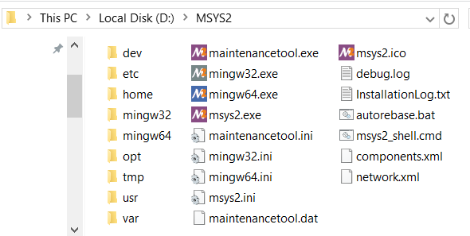
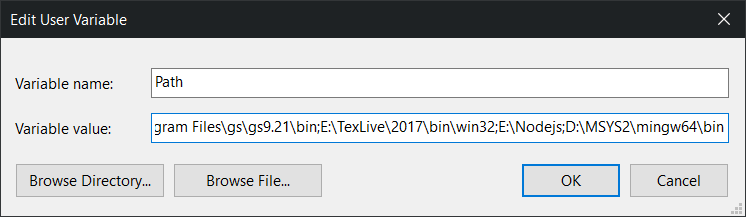
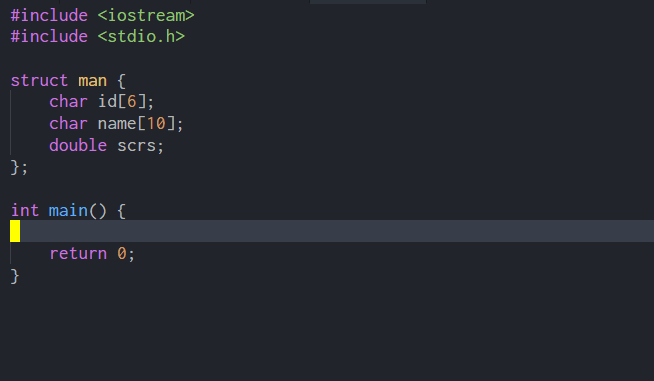

## Windows 下 VSCode 利用 Clang 对 C/C++ 进行补全

### 原料

- [VSCode](https://code.visualstudio.com/)
- [MSYS2](http://www.msys2.org/)

### 步骤

这里的 MSYS2 配置部分主要参考 [MSYS2开发环境搭建](http://blog.csdn.net/callinglove/article/details/48601775).

1. 下载 MSYS2 installer, 建议安装路径不包含空格(个人装在了 `D:` 下)
   <p align="center">
       
   </p>

1. 修改软件源, 修改 `/etc/pacman.d/` 目录下的三个文件, 换上清华的 repo,
   `.msys`, `.mingw32`, `.mingw64` 分别对应 MSYS2 里的三套系统,
   **分别**在三个文件最上方填写(注意对应):

   ```
   Server = https://mirrors.tuna.tsinghua.edu.cn/msys2/msys/$arch
   Server = https://mirrors.tuna.tsinghua.edu.cn/msys2/mingw/i686
   Server = https://mirrors.tuna.tsinghua.edu.cn/msys2/mingw/x86_64
   ```

   (听说中科大的源会炸, 是真的么)

1. 随便挑一个(`mingw32.exe`, `mingw64.exe`, `msys2.exe`)进入 `MSYS2` 的终端,
   更新系统:

   ```
   pacman -Syu
   ```

   提示需退出后更新, 强行关闭后重进, 再重复上述命令即可.
   更新其他包:

   ```
   pacman -Su
   ```

1. 安装开发工具链:

   ```
   pacman -S base-devel
   pacman -S gcc
   pacman -S mingw-w64-x86_64-toolchain
   pacman -S mingw-w64-i686-toolchain
   pacman -S mingw64/mingw-w64-x86_64-clang
   pacman -S mingw32/mingw-w64-i686-clang
   ```

1. 将 `/mingw64/bin` 加入系统环境变量(或者 `/mingw32/bin` )
   <p align="center">
       
   </p>
1. 在VSCode中安装[C/C++ Clang Command Adapter](https://github.com/mitaki28/vscode-clang)插件
1. 开耍
   <p align="center">
       
   </p>

### 注记

之前尝试过分别下载 MinGW GCC、LLVM-Clang 进行配置,
但发现一定情况下对 C++ 文件不提示, 于是干脆利用 MSYS2 直接对这些工具来个集成,
一来方便管理, 二来无需对 VSCode 进行过多的配置. 测试环境的各版本如下:

Entries                     | Version
------                      | ------
OS                          | Windows 10 x64 (1607)
VSCode                      | 1.14.2
C/C++ Clang Command Adapter | 0.2.2
GCC                         | (Rev2, Built by MSYS2 project) 7.1.0
Clang                       | 4.0.0 posix

### 更新

MSYS2 这个 Windows 下类的 Unix 系统毕竟有些庞大, 如果从实用角度出发,
只下载 [LLVM](http://releases.llvm.org/download.html) 以及
[C/C++ Clang Command Adapter](https://github.com/mitaki28/vscode-clang),
完全可以做到提示当前项目的各种函数, 在 VSCode 中设置 Clang 路径即可,
但如果要提示系统库函数, 可考虑自行下载 MinGW GCC, 并在插件中的 `cflag`,
`cxxflag` 中添加 `include` 路径, 下面是可行的配置(自行修改库头文件路径):

```json
{
    "clang.diagnostic.enable": false,
    "clang.executable": "E:\\LLVM\\x86\\bin\\clang.exe",
    "clang.cflags": [
        "-std=c99",
        "-IE:\\MinGW\\i686-5.4.0\\mingw32\\i686-w64-mingw32\\include",
        "-IE:\\MinGW\\i686-5.4.0\\mingw32\\include",
        "-IE:\\MinGW\\i686-5.4.0\\mingw32\\lib\\gcc\\i686-w64-mingw32\\5.4.0\\include"
    ]
}
```

推荐的版本组合为 LLVM 4.0.1 + MinGW 7.1.0.

### 链接

- [Windows下VSCode利用Ctags实现C/C++文件进行跳转](../08/c-c++-code-navigation-by-ctags-on-windows.md)
