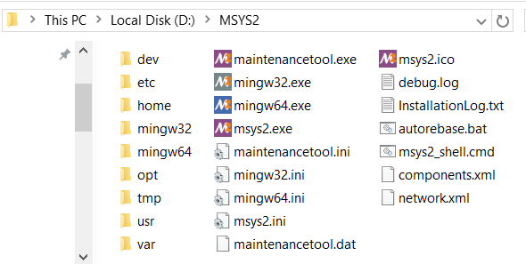
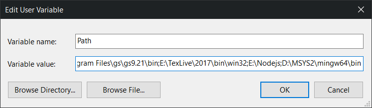

## Windows下VSCode利用Clang对C/C++进行补全

#### 原料

- [VSCode](https://code.visualstudio.com/)
- [MSYS2](http://www.msys2.org/)

#### 步骤

这里的 MSYS2 配置部分主要参考 「[MSYS2开发环境搭建](http://blog.csdn.net/callinglove/article/details/48601775)」.

1. 下载 MSYS2 installer, 建议安装路径不包含空格(个人装在了 `D:` 下)
   <p align="center">
       
   </p>

1. 修改软件源, 这里参考了 「[给 MSYS2 添加中科大的源](http://blog.csdn.net/liyuanbhu/article/details/56496501)」,
   不过为方便起见偷了过来. 修改 `/etc/pacman.d/` 目录下的三个文件,
   `.msys`, `.mingw32`, `.mingw64` 分别对应 `MSYS2` 里的三套系统,
   **分别**在三个文件最上方填写(注意对应):

   ```
   Server = https://mirrors.tuna.tsinghua.edu.cn/msys2/msys/$arch
   Server = https://mirrors.tuna.tsinghua.edu.cn/msys2/mingw/i686
   Server = https://mirrors.tuna.tsinghua.edu.cn/msys2/mingw/x86_64
   ```

1. 随便挑一个(`mingw32.exe`, `mingw64.exe`, `msys2.exe`)进入 `MSYS2` 的终端,
   更新系统:

   ```
   pacman -Syu
   ```

   提示需退出后更新, 强行关闭后重进, 再重复上述命令即可.
   更新其他包:

   ```
   pacman -Su
   ```

1. 安装开发工具链:

   ```
   pacman -S base-devel
   pacman -S gcc
   pacman -S mingw-w64-x86_64-toolchain
   pacman -S mingw-w64-i686-toolchain
   ```

1. 将 `/mingw64/bin` 加入系统环境变量(或者 `/mingw32/bin` )
   <p align="center">
       
   </p>
1. 在VSCode中安装[C/C++ Clang Command Adapter](https://github.com/mitaki28/vscode-clang)插件
1. 开耍
   <p align="center">
       
   </p>

#### 注记

之前尝试过分别下载 MinGW GCC、LLVM-Clang进行配置,
但发现一定情况下对 C++ 文件不提示, 于是干脆利用 MSYS2 直接对这些工具来个集成,
一来方便管理, 二来无需对 VSCode 进行过多的配置. 测试环境的各版本如下:

Entries                     | Version
------                      | ------
OS                          | Windows 10 x64 (1607)
VSCode                      | 1.14.2
C/C++ Clang Command Adapter | 0.2.2
GCC                         | (Rev2, Built by MSYS2 project) 7.1.0
Clang                       | 4.0.0 posix
