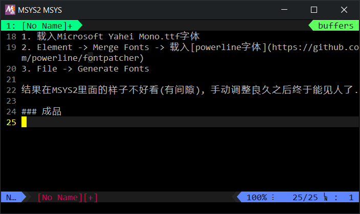
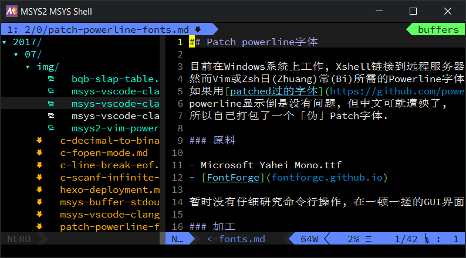

## Patch powerline 字体

目前在 Windows 系统上工作, Xshell 链接到远程服务器 + 本地 MSYS2,
然而 Vim 或 Zsh 日(Zhuang)常(Bi)所需的 Powerline 字体总让人有些烦心,
如果用 [patched过的字体](https://github.com/powerline/fonts),
powerline 显示倒是没有问题, 但中文可就遭殃了,
所以自己打包了一个「伪」Patch字体.

### 原料

- Microsoft Yahei Mono.ttf
- [FontForge](fontforge.github.io)

暂时没有仔细研究命令行操作, 在一顿一搓的 GUI 界面上完成合并操作:

### 加工

1. 载入 `Microsoft Yahei Mono.ttf` 字体
2. Element -> Merge Fonts -> 载入 [powerline字体](https://github.com/powerline/fontpatcher)
3. File -> Generate Fonts

结果在 MSYS2 里面的样子不好看(有间隙), 手动调整良久之后终于能见人了.

### 成品

    

---

### 2017-07-14 更新

发现自己合成的字体在 Clion 中打开全部为乱码,
肯定某个主要组成成分出了大问题(之前也出现过切换中文输入法无法输出中文的情况).
以后有空再做研究.

### 2017-08-05 更新

FontCreator 貌似是一款不错的工具(似乎要收费:astonished:)  
另外, 已放弃折腾组合字体, 改用海纳百川的
[Nerd Fonts](https://github.com/ryanoasis/nerd-fonts).

    

