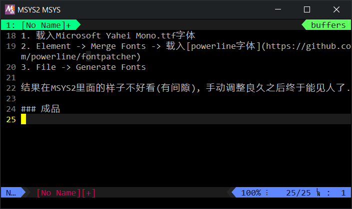

## Patch powerline字体

目前在Windows系统上工作, Xshell链接到远程服务器+本地MSYS2,
然而Vim或Zsh日(Zhuang)常(Bi)所需的Powerline字体总让人有些烦心,
如果用[patched过的字体](https://github.com/powerline/fonts),
powerline显示倒是没有问题, 但中文可就遭殃了,
所以自己打包了一个「伪」Patch字体.

### 原料

- Microsoft Yahei Mono.ttf
- [FontForge](fontforge.github.io)

暂时没有仔细研究命令行操作, 在一顿一搓的GUI界面上完成合并操作:

### 加工

1. 载入Microsoft Yahei Mono.ttf字体
2. Element -> Merge Fonts -> 载入[powerline字体](https://github.com/powerline/fontpatcher)
3. File -> Generate Fonts

结果在MSYS2里面的样子不好看(有间隙), 手动调整良久之后终于能见人了.

### 成品

    

