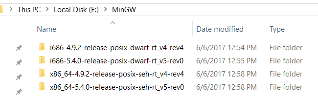
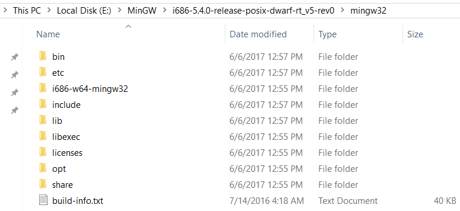
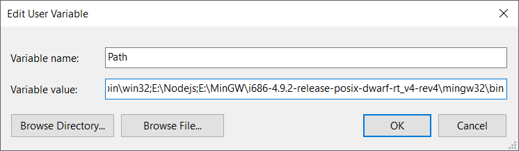
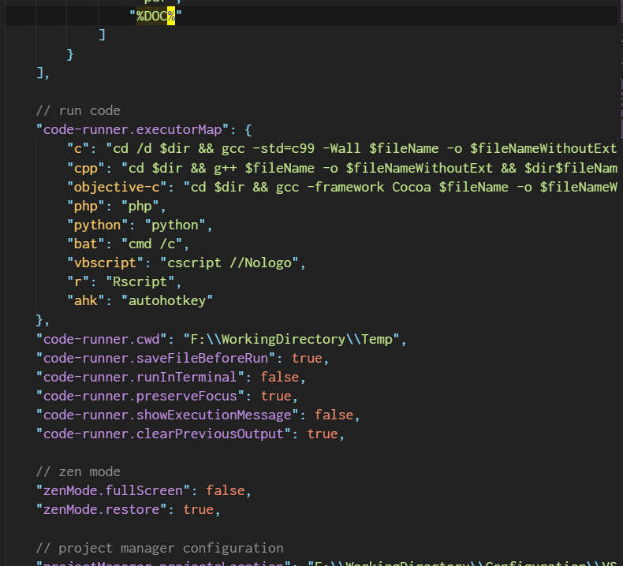

## 利用VSCode搭建简易C&C++编译环境

### 1. MinGW GCC工具链

- (可参考之前的gist: [eclipse配置C/C++编译环境](https://gist.github.com/michaelHL/8b5e18b0d3d3319d49b7998bb7de052a))
- 老版本[MinGW](http://www.mingw.org/)仅有`32`位的Tool Chain,
  若需要编译`64`位程序, 转至[MinGW-w64](https://sourceforge.net/projects/mingw-w64/)项目(**推荐**)
- 以`MinGW GCC 5.4.0 x86`为例, 依次在[Files](https://sourceforge.net/projects/mingw-w64/files)界面选择`Toolchains targetting Win32`,
  `Personal Builds`, `mingw-builds`, `5.4.0`, `threads-posix`,
  `dwarf`, `i686-5.4.0-release-posix-dwarf-...`进行下载.
  类似可下载`64`位以及其他版本的工具链(seh, dwarf, sjlj等)  
  直链: [i686-5.4.0-release-posix-dwarf-rt_v5-rev0.7z](https://sourceforge.net/projects/mingw-w64/files/Toolchains%20targetting%20Win32/Personal%20Builds/mingw-builds/5.4.0/threads-posix/dwarf/i686-5.4.0-release-posix-dwarf-rt_v5-rev0.7z/download)
- 解压:
  <p align="center">
      
  </p>
  目录结构如下:
  <p align="center">
      
  </p>
- 添加环境变量:
  <p align="center">
      
  </p>

### 2. VSCode配置

- <kbd>Ctrl</kbd><kbd>Shift</kbd><kbd>X</kbd>打开插件侧边栏,
   于搜索框中键入`code runner`, 安装即可(注意作者是[Jun Han](https://marketplace.visualstudio.com/items?itemName=formulahendry.code-runner)).
- `File` - `Preferences` - `Settings`, 或按下组合键
   <kbd>Ctrl</kbd><kbd>,</kbd>, 于右侧自定义设置中添加设置:

    ```json
    {
    "code-runner.executorMap": {
            "c": "cd /d $dir && gcc -std=c99 -Wall $fileName -o $fileNameWithoutExt.exe && $dir$fileNameWithoutExt.exe",
            "cpp": "cd $dir && g++ $fileName -o $fileNameWithoutExt && $dir$fileNameWithoutExt",
            "objective-c": "cd $dir && gcc -framework Cocoa $fileName -o $fileNameWithoutExt && $dir$fileNameWithoutExt"
        }
    }
    ```

   当然参数可以进一步定制.
   除此之外, 还可以有如下自定义设置以获更佳体验
   (注意`json`语法)

    ```json
    {
        "code-runner.saveFileBeforeRun": true,
        "code-runner.runInTerminal": false,
        "code-runner.preserveFocus": true,
        "code-runner.showExecutionMessage": false,
        "code-runner.clearPreviousOutput": true
    }
    ```

   配置完了应该是这样:
   <p align="center">
      
   </p>

- 开耍.
  <p align="center">
      
  </p>

