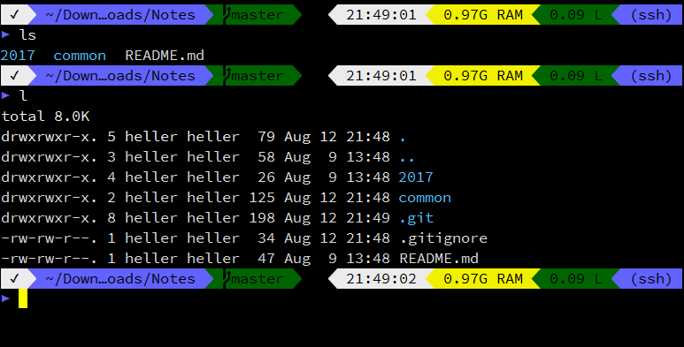

## Zsh 折腾记

**注** 试验场所有 CentOS(本地 + 远程), Ubuntu 14.04+, ~~MSYS2~~ (巨卡无比,
应该是 mintty 的锅, 不打算继续折腾, 见 [ConEmu 折腾笔记](../10/conemu-configuration.md#zsh))

### 安装 Zsh

```bash
yum install zsh
chsh -s /usr/bin/zsh
```

### 安装 Oh-My-Zsh

官方 [repo][oh-my-zsh-repo]

```bash
sh -c "$(curl -fsSL https://raw.githubusercontent.com/robbyrussell/oh-my-zsh/master/tools/install.sh)"
```

或

```bash
sh -c "$(wget https://raw.githubusercontent.com/robbyrussell/oh-my-zsh/master/tools/install.sh -O -)"
```

详情请见 oh-my-zsh 的 [wiki][oh-my-zsh-wiki].

### 主题

- Powerlevel9k: [repo][powerlevel9k-repo]
  ```bash
  git clone https://github.com/bhilburn/powerlevel9k.git ~/.oh-my-zsh/custom/themes/powerlevel9k
  ```
- 自带主题: [Themes][oh-my-zsh-themes]
- 额外主题: [External themes][oh-my-zsh-external-themes]

### 配置 `.zshrc`

见 [`.zshrc`](src/.zshrc)

---

秀一发:

<p align="center">
  
</p>

**注** 其中所用字体为 `Sauce Code Pro Nerd Font Complete Mono Windows Compatible`,
官方 [repo][nerdfonts-repo]

### 常见问题

- 不能更新, 提示
  `error: Cannot pull with rebase: You have unstaged changes.`
  ```bash
  cd $ZSH && git stash && cd -
  upgrade_oh_my_zsh
  ```


[oh-my-zsh-repo]: https://github.com/robbyrussell/oh-my-zsh
[oh-my-zsh-wiki]: https://github.com/robbyrussell/oh-my-zsh/wiki/Installing-ZSH
[oh-my-zsh-themes]: https://github.com/robbyrussell/oh-my-zsh/wiki/Themes
[oh-my-zsh-external-themes]: https://github.com/robbyrussell/oh-my-zsh/wiki/External-themes
[powerlevel9k-repo]: https://github.com/bhilburn/powerlevel9k
[nerdfonts-repo]: https://github.com/buzzkillhardball/nerdfonts
