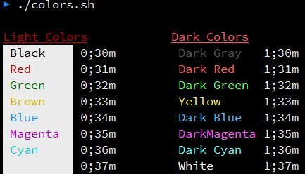

## Shell 脚本中的颜色

> 链接: [Shell Colors: colorizing shell scripts][link1]

Shell scripts commonly used ANSI escape codes for color output.
Following table shows Numbers representing colors in Escape Sequences.

| Color   | Foreground | Background |
| :---:   | :--------: | :--------: |
| Black   | 30         | 40         |
| Red     | 31         | 41         |
| Green   | 32         | 42         |
| Yellow  | 33         | 43         |
| Blue    | 34         | 44         |
| Magenta | 35         | 45         |
| Cyan    | 36         | 46         |
| White   | 37         | 47         |

The numbers in the above table work for xterm terminal.Result may vary
for other terminal emulators.

Use the following template for writing colored text.

```bash
echo -e "\033[COLORm Sample text"
```

The `\033[` begins the escape sequence. You can also use `\e[` instead
of `\033[`. COLOR specifies a foreground color, according to the table
above.The `m` terminates escape sequence, and text begins immediately
after that.

> **Note**: With an echo, the -e option enables the escape sequences. You can
> also use printf instead of echo.

```bash
printf "\e[COLORm sample text\n"
```

To print Green text

```bash
echo -e "\033[32m Hello World"
```

or

```bash
printf "\e[32m Hello World"
```

The problem with above statement is that the blue color that starts
with the 32 color code is never switched back to the regular color, so
any text you type after the prompt and even prompt also is still in the
Green color.

To return to the plain, normal mode, we have yet another sequence.

```bash
echo -e "\033[0m"
```

Now you won't see anything new on the screen, as this echo statement
was not passed any string to display. But it has done its job, which
was to restore the normal viewing mode. Whatever yor type now will be
avoid of any fancy effects.

Escape sequence also allow you to control the manner in which
characters are displayed on the screen.

The following table summarizes numbers representing text attributes
in Escape Sequences.

| ANSI CODE | Meaning                  |
| :-------: | :-----:                  |
| 0         | Normal Characters        |
| 1         | Bold Characters          |
| 4         | Underlined Characters    |
| 5         | Blinking Characters      |
| 7         | Reverse video Characters |

> **Note**: Blink attribute doesn't work in any terminal emulator, but it
> will work on the console.

Combining all these Escape Sequences, you can get more fancy effect.
Use the following template for writing colored text on a colored
background.

```bash
echo -e "\033[COLOR1;COLOR2m sample text\033[0m"
```

The semicolon separated numbers "COLOR1" and "COLOR2" specify a
foreground and a background color.The order of the numbers does not
matter, since the foreground and background numbers fall in non-
overlapping ranges. `m` terminates the escape sequence, and the text
begins immediately after that.Although setting the colors separately
also work (i.e. `\033[44m\033[32m`).

There are some differences between colors when combining colors with
bold text attribute.

The following table summarises these differences.

| Bold off | color      | Bold on | color        |
| :------: | :---:      | :-----: | :---:        |
| 0;30     | Balck      | 1;30    | Dark Gray    |
| 0;31     | Red        | 1;31    | Dark Red     |
| 0;32     | Green      | 1;32    | Dark Green   |
| 0;33     | Brown      | 1;33    | Yellow       |
| 0;34     | Blue       | 1;34    | Dark Blue    |
| 0;35     | Magenta    | 1;35    | Dark Magenta |
| 0;36     | Cyan       | 1;30    | Dark Cyan    |
| 0;37     | Light Gray | 1;30    | White        |

The following shell script prints all the colors and codes on the screen.

```bash
#!/bin/bash
# This script echoes colors and codes

echo -e "\n\033[4;31mLight Colors\033[0m  \t\t\033[1;4;31mDark Colors\033[0m"
echo -e "\e[0;30;47m Black    \e[0m 0;30m \t\e[1;30;40m Dark Gray  \e[0m 1;30m"
echo -e "\e[0;31;47m Red      \e[0m 0;31m \t\e[1;31;40m Dark Red   \e[0m 1;31m"
echo -e "\e[0;32;47m Green    \e[0m 0;32m \t\e[1;32;40m Dark Green \e[0m 1;32m"
echo -e "\e[0;33;47m Brown    \e[0m 0;33m \t\e[1;33;40m Yellow     \e[0m 1;33m"
echo -e "\e[0;34;47m Blue     \e[0m 0;34m \t\e[1;34;40m Dark Blue  \e[0m 1;34m"
echo -e "\e[0;35;47m Magenta  \e[0m 0;35m \t\e[1;35;40m DarkMagenta\e[0m 1;35m"
echo -e "\e[0;36;47m Cyan     \e[0m 0;36m \t\e[1;36;40m Dark Cyan  \e[0m 1;36m"
echo -e "\e[0;37;47m LightGray\e[0m 0;37m \t\e[1;37;40m White      \e[0m 1;37m"
```

OUTPUT:

<p align="center">
    
</p>

### Some examples

Block background and white text

```bash
echo -e "\033[40;37m Hello World\033[0m"
```

Reverse video text attribute option interchanges fg and bg colors.
Bellow statement prints block on white

```bash
echo -e "\033[40;37;7m Hello World\033[0m"
echo -e "\033[33;44m Yellow text on blue background\033[0m"
echo -e "\033[1;33;44m Bold yellow text on blue background\033[0m"
echo -e "\033[1;4;33;44mBold yellow underlined text on blue background\033[0m"
```

The `tput` command:

> Other than echo there is a command called tput using which we
> can control the way the output is displayed on the screen.But it is
> less flexible than ANSI escape sequences.


---

> 链接: [shell脚本中echo显示内容带颜色][link2]

shell 脚本中 `echo` 显示内容带颜色显示, `echo` 显示带颜色, 需要使用参数 `-e`,
格式如下:

```bash
echo -e "\033[字背景颜色;文字颜色m字符串\033[0m"
```

例如:

```bash
echo -e "\033[41;36m something here \033[0m"
```

其中 41 的位置代表底色, 36 的位置是代表字的颜色

**注**

1. 字背景颜色和文字颜色之间是英文的 ""
2. 文字颜色后面有个 m

下面是相应的字和背景颜色, 可以自己来尝试找出不同颜色搭配

```
echo -e "\033[31m 红色字 \033[0m"
echo -e "\033[34m 黄色字 \033[0m"
echo -e "\033[41;33m 红底黄字 \033[0m"
echo -e "\033[41;37m 红底白字 \033[0m"
```

字颜色：30—–37

```bash
echo -e "\033[30m 黑色字 \033[0m"
echo -e "\033[31m 红色字 \033[0m"
echo -e "\033[32m 绿色字 \033[0m"
echo -e "\033[33m 黄色字 \033[0m"
echo -e "\033[34m 蓝色字 \033[0m"
echo -e "\033[35m 紫色字 \033[0m"
echo -e "\033[36m 天蓝字 \033[0m"
echo -e "\033[37m 白色字 \033[0m"
```

字背景颜色范围: 40 - 47

```bash
echo -e "\033[40;37m 黑底白字 \033[0m"
echo -e "\033[41;37m 红底白字 \033[0m"
echo -e "\033[42;37m 绿底白字 \033[0m"
echo -e "\033[43;37m 黄底白字 \033[0m"
echo -e "\033[44;37m 蓝底白字 \033[0m"
echo -e "\033[45;37m 紫底白字 \033[0m"
echo -e "\033[46;37m 天蓝底白字 \033[0m"
echo -e "\033[47;30m 白底黑字 \033[0m"
```

最后面控制选项说明

```bash
\33[0m 关闭所有属性
\33[1m 设置高亮度
\33[4m 下划线
\33[5m 闪烁
\33[7m 反显
\33[8m 消隐
\33[30m - \33[37m 设置前景色
\33[40m - \33[47m 设置背景色
\33[nA 光标上移n行
\33[nB 光标下移n行
\33[nC 光标右移n行
\33[nD 光标左移n行
\33[y;xH设置光标位置
\33[2J 清屏
\33[K 清除从光标到行尾的内容
\33[s 保存光标位置
\33[u 恢复光标位置
\33[?25l 隐藏光标
\33[?25h 显示光标
```

[link1]: http://www.bashguru.com/2010/01/shell-colors-colorizing-shell-scripts.html
[link2]: https://www.cnblogs.com/lr-ting/archive/2013/02/28/2936792.html
